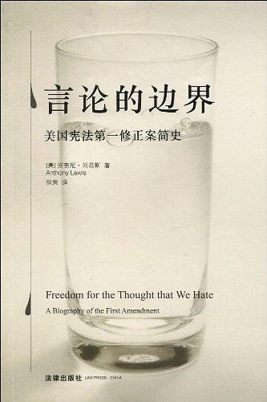

# 《言论的边界》导读

## 起因

- 图书馆闲逛，偶然看到这本书。
- 书名很好：
  - 引出问题：言论的边界在哪里？言论自由是否有一个明确的边界？美国自诩为全世界最自由最民主的国家，以客观的角度看看它的言论自由究竟有一个怎样的历史。
- 这么好的书，当然是——加进书单慢慢排队吧。于是等到9/2才看完。

## 本书架构

两条线：

1. 以时间为序：从整体上看，言论的边界是如何被逐渐扩大、被逐渐明确的？

2. - 讨论了言论自由面对的各种主题：

     - 政治势力
     - 国家安全
     - 诽谤、隐私
     - 色情内容
     - 仇视性言论，等等

   - 同时提出3个问题：

     1. 言论的边界真的在一直扩大吗？
        
- 作者提到每次美国在遇到来自国外的可能存在的威胁的时候，这一边界就会倒退。比如1789年法国雅各宾派专政，引发的革命恐惧；20世纪初，一战和二战中对于德国的恐惧；20世纪对于红色政权的恐惧；21世纪对于恐怖主义的恐惧等等，都会使政府加紧对言论的控制。
        
2. 言论的边界应该被无限制地扩大吗？
     
   - 在这一点上，作者对部分议题提出了一些看法。比如关于隐私权。
     
     > “第一修正案关于言论和出版自由的规定对于保障人类自由来说，无疑是重要的；但对于构建一个健康的社会，这不是唯一重要的。倘若实现言论自由将以牺牲个人隐私为代价，那么它只会是一个令人恐惧的胜利。”
     
     3. 言论自由是否有的一个明确的边界？
        
        - 因为美国法官自主权比较大，激进和保守的程度不同，对于一类问题，很难有一个明确的界定。所以在很多情况下，这是没有一个明确的边界的。

## 本书特点

- 部分章节名很有特点：

  - 恐惧本身——罗斯福

  - “另一个人的抒情诗”

    > ​		“一个人的粗话却可能是另一个人的抒情诗”——约翰·马歇尔·哈伦法官

  - “流浪汉与不法之徒”——查尔斯·狄更斯

  - 我们所痛恨的思想

    > ​	“那些为我们所痛恨的思想，同样自由。”——霍姆斯法官

## 读这本书的意义何在？

1. 这本书虽然详细地介绍了美国宪法第一修正案简史，但是仍有时代的局限性。这本书已经出版了十多年了，面对如今更加多元化的媒体，更加激进的舆论和更加无处躲藏的个人隐私，我们会有怎样的思考？
2. 对于辅修法学和对法学有兴趣的同学，拥有不同的视角，一定能收获更多的东西。
3. 这本书和《论美国的民主》搭配来看，相信会有奇妙的化学反应。

再此只做介绍，就不再多说了，谢谢大家！